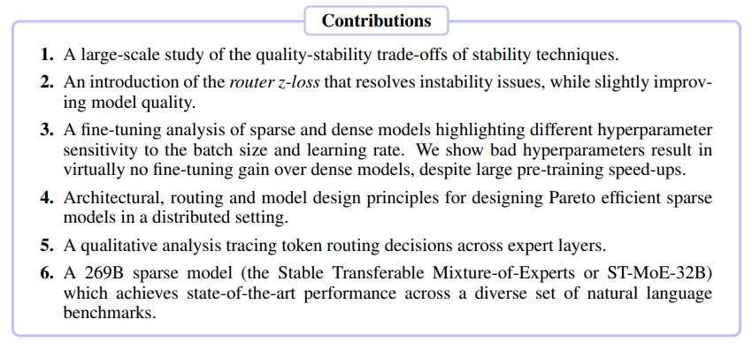

</img>

## ST-MoE - Pytorch

Implementation of <a href="https://arxiv.org/abs/2202.08906">ST-MoE</a>, the latest incarnation of mixture of experts after years of research at Brain, in Pytorch. Will be largely a transcription of the <a href="https://github.com/tensorflow/mesh/blob/master/mesh_tensorflow/transformer/moe.py">official Mesh Tensorflow implementation</a>. If you have any papers you think should be added, while I have my attention on mixture of experts, please open an issue.

This should be SOTA for mixture-of-experts for autoregressive transformers. For non-autoregressive, would recommend going with the simpler and better <a href="https://github.com/lucidrains/soft-moe-pytorch">Soft MoE</a>.

## Install

```bash
$ pip install st-moe-pytorch
```

## Appreciation

- <a href="https://stability.ai/">StabilityAI</a> for the generous sponsorship, as well as my other sponsors, for affording me the independence to open source artificial intelligence.

- <a href="https://github.com/arankomat">Aran Komatsuzaki</a> for consultation on mixture-of-experts, for removal of 2-level MoE and simplifications to code

## Usage

```python
import torch
from st_moe_pytorch import MoE

moe = MoE(
    dim = 512,
    num_experts = 16,               # increase the experts (# parameters) of your model without increasing computation
    gating_top_n = 2,               # default to top 2 gating, but can also be more (3 was tested in the paper with a lower threshold)
    threshold_train = 0.2,          # at what threshold to accept a token to be routed to second expert and beyond - 0.2 was optimal for 2 expert routing, and apparently should be lower for 3
    threshold_eval = 0.2,
    capacity_factor_train = 1.25,   # experts have fixed capacity per batch. we need some extra capacity in case gating is not perfectly balanced.
    capacity_factor_eval = 2.,      # capacity_factor_* should be set to a value >=1
    loss_coef = 1e-2,               # multiplier on the auxiliary expert balancing auxiliary loss
    router_z_loss_coef = 1e-3,      # loss weight for router z-loss
)

inputs = torch.randn(4, 1024, 512)
out, balance_loss, router_z_loss = moe(inputs) # (4, 1024, 512), (1,), (1,)

# for the entire mixture of experts block, in context of transformer

from st_moe_pytorch import SparseMoEBlock

moe_block = SparseMoEBlock(
    moe,
    add_ff_before = True,
    add_ff_after = True
)

out, balance_loss, router_z_loss = moe_block(inputs) # (4, 1024, 512), (1,), (1,)
```

## Todo

- [x] add the router z-loss proposed in paper
- [x] add the geglu expert with multiplicative gating
- [x] add an entire sparse moe block, complete with rmsnorm + residual as well as the ability to specify a feedforward before or after for stability
- [x] double check equation for router z-loss for experts inner in hierarchical moe
- [x] redo all the transcribed code from google with einops, as it is not very clear
- [x] consult some MoE experts in the open source community; question why hierarchical MoE is needed, in light of results from soft-MoE
- [x] offer top-n gating generalization, as it seems top3 (with smaller threshold) can work even better
- [x] figure out if there was an error in <a href="https://github.com/lucidrains/mixture-of-experts/blob/master/mixture_of_experts/mixture_of_experts.py#L210">a previous transcription</a> - no there was not an error
- [x] allow for different thresholds for second vs third routed expert
- [x] add coordinate descent based routing
- [x] make first naive non-optimized attempt at distributed code for mixture of experts

- [ ] distributed
    - [ ] optimize
    - [ ] make all distributed code pluggable, for different strategies
    - [ ] figure out why there is tiny error in gradients
    - [ ] support variable batch and sequence lengths

- [ ] improvise a `Top2GatingWithCoordinateDescent` for `MoE` without `importance`

## Citations

```bibtex
@inproceedings{Zoph2022STMoEDS,
    title   = {ST-MoE: Designing Stable and Transferable Sparse Expert Models},
    author  = {Barret Zoph and Irwan Bello and Sameer Kumar and Nan Du and Yanping Huang and Jeff Dean and Noam M. Shazeer and William Fedus},
    year    = {2022}
}
```
